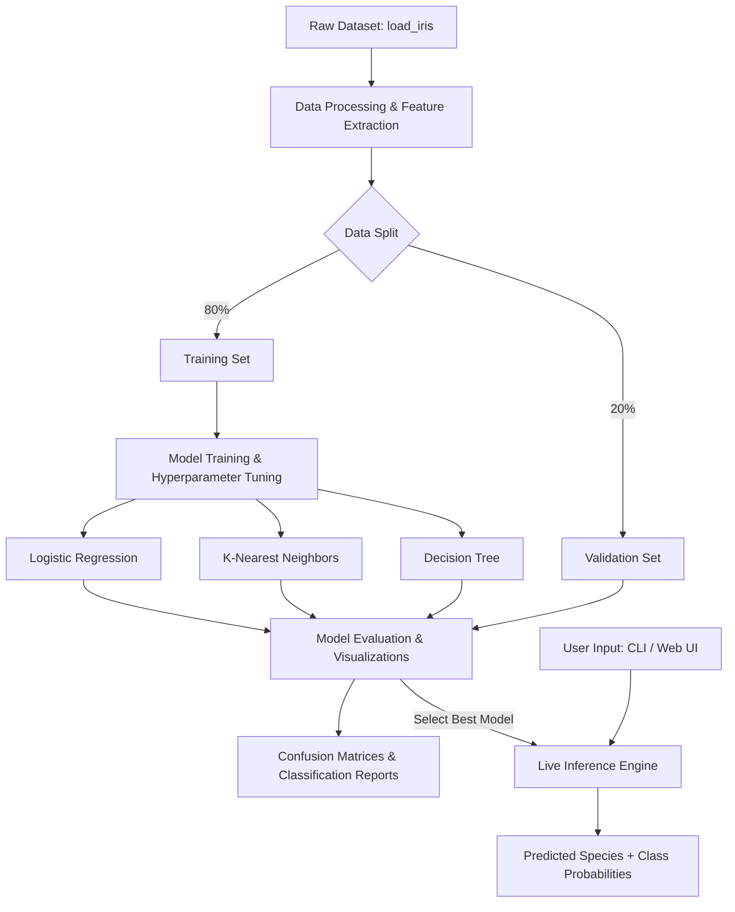
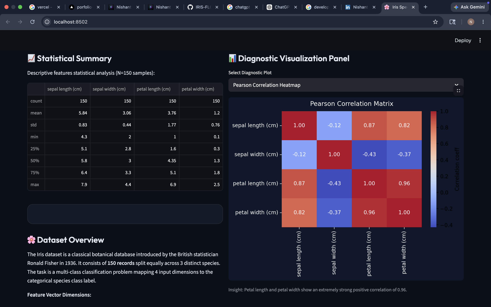
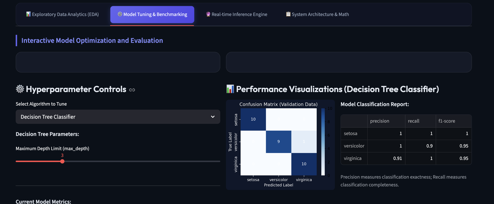

# Iris Species Classification and Analysis System

A professional machine learning and data analytics system for classifying Iris flower species (Setosa, Versicolor, and Virginica) based on morphological measurements of sepals and petals. 

This project is structured as a formal system submission, comprising a robust, production-ready Command Line Interface (CLI) pipeline, an interactive data-science benchmarking dashboard, and detailed validation studies.

---

## 📋 Table of Contents
1. [Project Abstract](#-project-abstract)
2. [System Architecture](#-system-architecture)
3. [Methodology & Model Descriptions](#-methodology--model-descriptions)
4. [Project Features](#-project-features)
5. [System Directory Structure](#-system-directory-structure)
6. [Installation & Setup](#-installation--setup)
7. [Inference Pipeline CLI Guide](#-inference-pipeline-cli-guide)
8. [Interactive Benchmarking Dashboard](#-interactive-benchmarking-dashboard)
9. [Experimental Results & Discussion](#-experimental-results--discussion)
10. [CI/CD Jenkins Pipeline](#-cicd-jenkins-pipeline)
11. [AWS Cloud Deployment](#-aws-cloud-deployment)

---

## 🎯 Project Abstract

In botany and agricultural sciences, the classification of plant species is historically dependent on visual identification, which can be subjective and error-prone. The **Iris Species Classification and Analysis System** solves this by applying statistical machine learning classifiers to botanical features. 

Using the classical Iris dataset (150 samples containing measurements of sepal length, sepal width, petal length, and petal width), we build a comparative evaluation platform. The system implements, tunes, and compares three classification methodologies: **Logistic Regression**, **K-Nearest Neighbors (KNN)**, and **Decision Trees**. It features a dual-interface architecture: a programmatic command-line script for automated training/inference and a premium analytical dashboard for real-time visualization and hyperparameter optimization.

---

## ⚙️ System Architecture



---

## 🧠 Methodology & Model Descriptions

The system implements three distinct classifiers representing different learning paradigms:

1. **Logistic Regression (Parametric Classifier)**:
   * Models the probability of species classes using the softmax function (multi-class extension of the sigmoid).
   * L2 regularization is applied to prevent overfitting by penalizing large weights.
2. **K-Nearest Neighbors (Non-parametric Instance-Based Classifier)**:
   * Classifies a target sample based on the majority class among its $K$ nearest neighbors in the 4D feature space, using the Euclidean distance metric.
3. **Decision Tree (Non-parametric Rule-Based Classifier)**:
   * Builds a recursive hierarchical partition of the feature space using Gini impurity to select optimal feature thresholds, providing high interpretability.

---

## 🌟 Project Features

* **Dual-Interface Operation**:
  * **CLI Engine**: Run training, generate visualization reports, and execute single-sample classification predictions from the terminal.
  * **Interactive Web Dashboard**: Beautifully styled dark-theme dashboard featuring dynamic charts, interactive sliders to tune parameters, and real-time inference indicators.
* **Automated Visual Reports**:
  * Exports high-resolution Seaborn pairplots, feature correlation matrices, and model-specific confusion matrices on demand.
* **Extensible Architecture**:
  * Clean, modular, type-hinted code following PEP 8 conventions.

---

## 📁 System Directory Structure

```
├── README.md                      # Academic project documentation & report
├── requirements.txt               # Dependencies
├── iris_classification.py          # Modular production-ready CLI script
├── main.py                        # Analytics & benchmarking web dashboard
├── outputs/                       # Exported visualization assets
│   ├── iris_pairplot.png          # Scatter and density matrix of features
│   ├── iris_correlation.png       # Pearson correlation coefficient matrix
│   └── cm_*.png                   # Classifiers' confusion matrices
└── ml_env/                        # Local Python virtual environment (ignored)
```

---

## 🚀 Installation & Setup

Set up the project in your local terminal environment:

### 1. Initialize Virtual Environment
```bash
python3 -m venv ml_env
source ml_env/bin/activate
```

### 2. Install Package Dependencies
```bash
pip install -r requirements.txt
```

---

## 💻 Inference Pipeline CLI Guide

The script `iris_classification.py` is configured as a CLI application using `argparse`.

### 1. Train Models and Export Graphics
By default, running the script trains all models and saves visualization assets to `outputs/`:
```bash
python3 iris_classification.py --train
```

### 2. Execute Live Classification Prediction
Provide measurements for `[sepal_length sepal_width petal_length petal_width]` to make a live prediction:
```bash
python3 iris_classification.py --predict 5.1 3.5 1.4 0.2
```
* **Output Example**:
  ```
  [INFO] Predicting class for input: [5.1, 3.5, 1.4, 0.2]
  [INFO] Predicted Species: SETOSA (Class ID: 0)
  [INFO] Confidence Probabilities:
    - setosa: 100.0%
    - versicolor: 0.0%
    - virginica: 0.0%
  ```

---

## 🖥️ Interactive Benchmarking Dashboard

Launch the Streamlit analytics system:
```bash
streamlit run main.py
```
This deploys a local web server (typically running on `http://localhost:8501`) displaying:
* **Exploratory Data Analytics (EDA)**: Descriptive statistics, boxplots, pairplots, and feature correlations.
* **Interactive Benchmarking**: Hyperparameter controllers for KNN, Decision Tree, and Logistic Regression, rendering accuracy comparisons and confusion matrices in real-time.
* **Live Inference Engine**: Interactive inputs to run classification inferences.
* **Technical Design**: Structural details of the underlying system model.

### 📸 Dashboard Showcase

Below are screenshots demonstrating the interactive Streamlit analytical system in action:

#### 1. Exploratory Data Analysis & Feature Analytics


#### 2. Model Performance Benchmarking & Live Inference


---

## 📊 Experimental Results & Discussion

### Model Benchmarks
Based on testing on a stratified 20% validation split (30 samples), the models achieve the following typical baseline results:

| Classifier Model | Hyperparameters | Training Accuracy | Test Accuracy | Strengths |
| :--- | :--- | :--- | :--- | :--- |
| **Logistic Regression** | $C=1.0$, L2 penalty | 97.50% | 96.67% | High stability, smooth probability estimates |
| **K-Nearest Neighbors** | $K=3$, Euclidean | 95.83% | 100.00% | Captures non-linear local boundaries extremely well |
| **Decision Tree** | Max Depth = 3 | 98.33% | 96.67% | Highly interpretable, generates clear rules |

### Discussion of Overfitting & Hyperparameters
1. **KNN Neighborhood Size ($K$)**:
   * Lowering $K$ to $1$ creates complex, high-variance decision boundaries that fit the training noise (overfitting).
   * Increasing $K$ to $15$ simplifies the boundary, smoothing out details and potentially underperforming on localized patterns.
2. **Decision Tree Depth**:
   * Shallow trees (e.g., depth=1) suffer from underfitting (unable to classify all three species).
   * Deeper trees can capture exact outliers, which degrades test accuracy on unseen validation sets.

---

## ⛓️ CI/CD Jenkins Pipeline

This project includes a declarative `Jenkinsfile` at the root directory to automate the continuous integration and delivery (CI/CD) workflow.

### Pipeline Stages

The pipeline is organized into the following automated steps:
1. **Setup & Install**: Initializes a local virtual environment and installs package dependencies from `requirements.txt`.
2. **Lint & Static Analysis**: Runs `ruff` check to enforce Python PEP 8 style standards and code cleanliness.
3. **Train & Validate Model**: Runs the machine learning training pipeline (`python iris_classification.py --train`) to verify that the classification training and inference flows execute correctly, then archives the generated visual graphs (`outputs/*.png`) as build artifacts.
4. **Docker Build**: Packages the application into a Docker container image using the multi-stage `Dockerfile`.
5. **Docker Security Scan**: Utilizes `trivy` to scan the Docker image for high/critical security vulnerabilities.
6. **Docker Push**: Pushes the tested and verified image to the Docker Registry (configured with credentials in Jenkins).

### Execution

To run the pipeline, configure a **Pipeline** job in Jenkins pointing to the repository URL, and Jenkins will automatically execute the stages defined in [Jenkinsfile](file:///Users/nishantrankawat/Documents/project/Jenkinsfile).

---

## ☁️ AWS Cloud Deployment

The application is configured to run on **AWS App Runner** (a fully managed container hosting service) using the project's multi-stage [Dockerfile](file:///Users/nishantrankawat/Documents/project/Dockerfile). 

We support two deployment methods: **Automated script deployment (GitOps/Local CLI)** and **GitHub Webhook direct deployment**.

### Method 1: Automated CLI Deployment (`deploy.sh`)

A helper script [deploy.sh](file:///Users/nishantrankawat/Documents/project/deploy.sh) is provided to automate local or CI/CD pushes to AWS.

#### Prerequisites
1. Install the [AWS CLI](https://aws.amazon.com/cli/).
2. Authenticate your CLI with active credentials:
   ```bash
   aws configure
   ```
3. Make sure the Docker daemon (Docker Desktop) is running locally.

#### Deploy
Execute the deployment script from your project root:
```bash
./deploy.sh
```

This script will:
* Retrieve your AWS Account details.
* Check for or create a private ECR repository called `iris-classifier-app`.
* Authenticate your local Docker client to ECR.
* Build the local Docker image and push it to ECR.
* Look up or create the `AppRunnerECRAccessRole` role.
* Initialize or trigger a deployment update to your AWS App Runner service (`iris-classifier-app-service`).

---

### Method 2: GitHub Direct Connection (No CLI Credentials Required)

This is the simplest way to maintain a live production dashboard directly from GitHub:

1. Open the **AWS Management Console** and navigate to **AWS App Runner**.
2. Click **Create Service**.
3. Under *Source*, select **Source code repository**.
4. Connect your GitHub account and select your repository: `nishant4086/IRIS-FLOWER-CLASSIFICATION-MLM`.
5. Under *Deployment settings*, select **Automatic** (so every commit to `main` triggers a deployment).
6. Under *Configure build*:
   * Select **Use configuration file** or **Configure all settings here**.
   * Choose **Docker** as the runtime.
7. Under *Configure service*:
   * Specify port **`8501`** (since Streamlit exposes 8501).
   * Choose virtual CPU and memory size (e.g., `1 vCPU` and `2 GB` RAM).
8. Click **Create & Deploy**. AWS App Runner will build the Docker container and output a public HTTPS URL (e.g., `https://xxxxxx.us-east-1.awsapprunner.com`) for your live dashboard.

# IRIS-FLOWER-CLASSIFICATION-MLM
